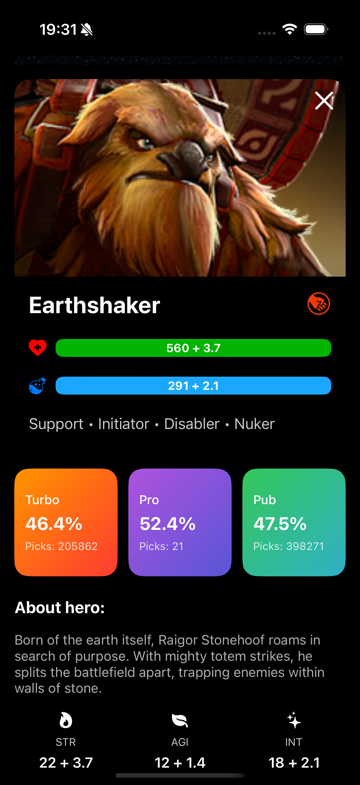
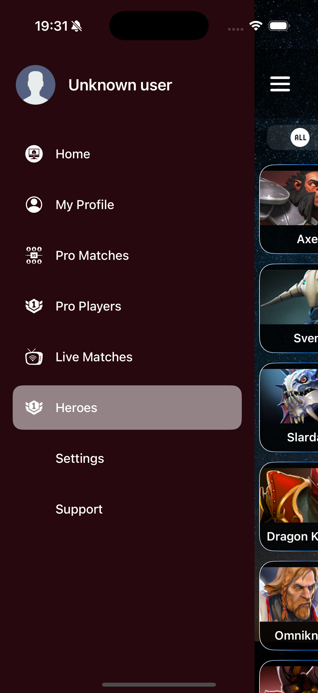

# Dota2 iOS App

iOS application built with UIKit using MVVM architecture.

## 🚀 Features
- Live Matches
- Upcoming Matches
- Finished Matches
- Top Heroes Statistics
- PandaScore API Integration

## 🏗 Architecture
- MVVM
- Compositional Layout
- Diffable Data Source
- Async/Await Networking

## 🛠 Tech Stack
- Swift
- UIKit
- URLSession
- Kingfisher

## 📱 Screenshots
(Screenshots will be added below)

  
  
  
  

  
  
  
  

